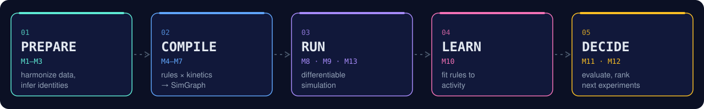
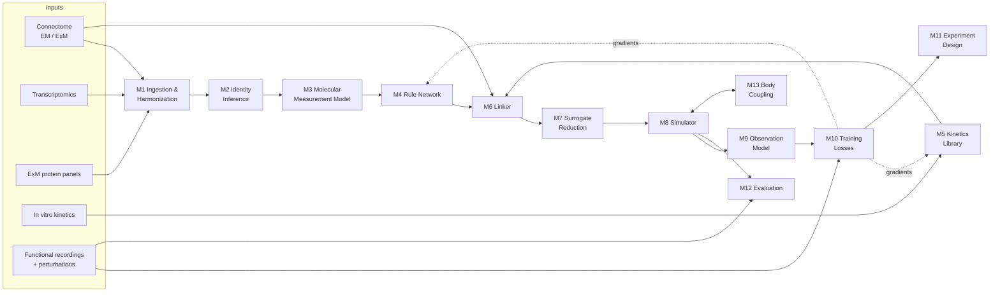

<div align="center">


<br>

[](spec.md)
[](LICENSE)
[](spec.md#73-implementation-stack)
[](#target-systems)
[](spec.md)

**Anatomy plus molecules goes in. A runnable nervous system comes out.**

[Overview](#overview) · [Pipeline](#pipeline) · [Principles](#design-principles) · [Targets](#target-systems) · [API](#planned-api) · [Evaluation](#evaluation) · [Roadmap](#roadmap)

</div>

---

## Overview

`molecular-compiler` takes the static wiring of a nervous system (a **connectome**) and the molecular makeup of its neurons (**transcriptomics, protein panels, channel kinetics**) and compiles them into a **differentiable simulation**. That simulation's spontaneous activity, stimulus responses, and single-neuron perturbation responses should match the real animal's.

The compiler doesn't fit a new model for each animal. It learns **molecular rules** instead: how a given channel, receptor, or gap-junction protein turns into conductances and dynamics. Those rules are shared across neurons, across animals, and eventually across species.

> [!NOTE]
> This project is in the **specification phase**. The full engineering design is in [`spec.md`](spec.md). There's no code yet. The API below is the planned interface.

<table>
<tr>
<td width="33%" valign="top">

### 🧬 Compositional
Each parameter is a **measured geometric gate × a learned molecular rule**. Rules are learned per molecule, never as per-neuron lookup tables, so they can extrapolate to neuron classes the model hasn't seen.

</td>
<td width="33%" valign="top">

### ⚡ Linear-time
Rule parameters don't depend on neuron count. Each simulation step costs **O(N + nnz)**, from 302 worm neurons up to a ~50M-synapse fly brain on a single GPU.

</td>
<td width="33%" valign="top">

### 🎯 Zero-shot first
Headline results are measured on **held-out neurons, classes, states, and species** with residuals turned off. The compiler is judged on what it predicts, not on what it memorizes.

</td>
</tr>
</table>

## Pipeline





<details>
<summary><b>Module reference (M1–M13)</b></summary>

<br>

| Module | Role |
|:--|:--|
| **M1** Ingestion & Harmonization | Converts raw connectome, expression, recording, and kinetics data into validated, unit-checked Parquet / Zarr / NWB with provenance hashes |
| **M2** Identity Inference | Aligns connectome neurons to transcriptomic types with fused Gromov–Wasserstein optimal transport, giving soft identity posteriors |
| **M3** Molecular Measurement Model | Maps mRNA to protein-level, location-specific abundance, with explicit uncertainty |
| **M4** Rule Network | The compiler core. A set encoder over gene tokens (from protein language model embeddings) feeds masked heads for channels, receptors, gap junctions, peptidergic transmission, neuromodulation, and short-term plasticity |
| **M5** Kinetics Library | One Hodgkin–Huxley / Markov / ligand-gated model per molecule, initialized from in vitro priors |
| **M6** Linker | Compartment reduction, Nernst/GHK reversal potentials, a connectome error model, and CSR assembly into a `SimGraph` |
| **M7** Surrogate Reduction | Fast reduced models for each molecular type, with validity envelopes and fallback to the full model |
| **M8** Simulator | Rush–Larsen gating and a semi-implicit voltage update that solves the sparse system coupled by gap junctions, in `sequential`, `event`, and experimental parallel-in-time modes |
| **M9** Observation Model | Calcium dynamics, indicator kernels, per-neuron gains, and optogenetic drive |
| **M10** Training | Trajectory, statistics, and perturbation losses plus priors, with gauge fixing and a staged curriculum |
| **M11** Experiment Design | Ranks stimulation targets, mutants, drugs, and ExM panels by expected information gain per unit cost |
| **M12** Evaluation Harness | Metrics normalized to the noise ceiling, compared against baselines B0–B3 |
| **M13** Body Coupling | Closed-loop worm body and NeuroMechFly adapters |

</details>

## Design principles

1. **Geometry × molecules.** Each parameter is a measured geometric gate times a learned molecular rule.
2. **Compositional rules.** Learn the contribution of each molecule, never whole-neuron or whole-synapse lookup tables.
3. **Compile time vs. run time.** Expensive mechanistic modeling runs once per molecular type. Run time uses reduced surrogates.
4. **Uncertainty is first-class.** Identity, connectome edges, and measurement gains are distributions, not point values.
5. **Zero-shot is the headline.** Any claim about the compiler is tested on held-out data with residuals disabled.
6. **Wiring is not the only path.** Neuropeptide signaling between unconnected neurons gets its own pathway, gated by peptide and receptor expression. Whether it's needed is tested in Phase 0.

> Synaptic sign is never stored. It comes from the receptor reversal potential $E_r$ and the membrane voltage $V$ at run time.

## Target systems

| | System | Role | Neurons | Synapses |
|:-:|:--|:--|--:|--:|
| 🪱 | *C. elegans* | Primary training and validation | 302 | thousands (4,887 chemical + 1,447 gap-junction edges) |
| 🪰 | *Drosophila* optic lobe | First transfer target | ~53,000 | millions |
| 🪰 | *Drosophila* whole brain | Full transfer target | 139,255 | ~50 million |
| 🐟 | Larval zebrafish | First vertebrate | ~100,000 | TBD |
| 🐭 | Mouse | Long-term target | ~70 million | ~10¹¹ |

## Planned API

```python
import molecular_compiler as mc

graph = mc.prepare(connectome, molecular, anchors=exm)        # M1–M3
sim   = mc.compile(graph, rules, kinetics, state=starved)     # M4–M7 → SimGraph
traj  = mc.simulate(sim, stimulus, duration_s=60.0,
                    mode="sequential", body=worm_body)        # M8 + M13
rec   = mc.observe(traj, gcamp6s)                             # M9

report = mc.evaluate(ensemble, kinetics,
                     split="leave_class_out",
                     benchmarks=["perturbation", "spontaneous"])  # M12
next_  = mc.propose_experiments(ensemble, catalog, budget=10.0)   # M11
```

## Evaluation

Every metric is normalized by the data's noise ceiling. The compiler is compared against four baselines:

| ID | Baseline | Question it answers |
|:-:|:--|:--|
| **B0** | Connectome only: synapse counts, transmitter-predicted sign, uniform dynamics | Does molecular information help at all? |
| **B1** | Black-box kernel on the same inputs | Does compositionality help extrapolation? |
| **B2** | Structure-free model trained on the same recordings | Does anatomy help? |
| **B3** | Per-animal fit with residuals enabled | Upper reference, not a target |
| **B4** | Synapse-only compiler (peptidergic heads removed) | Is non-wired transmission needed? |
| **B5** | Connectome-constrained data fit, no molecular rules | Do molecular rules add anything beyond anatomy? |
| **B6** | Task-trained connectome model (fly optic lobe) | Does the compiler beat the strongest structural alternative? |

**Acceptance criterion:** beat B0, B1 **and B2** on `leave_class_out` perturbation metrics, with residuals off, a pre-registered class partition, and paired-bootstrap 95% CIs that exclude zero.

The held-out splits are `leave_animal_out`, `leave_neuron_out`, `leave_class_out`, `leave_state_out`, and `leave_species_out`.

## Roadmap

- [ ] **Phase 0: Feasibility.** Gauge audit, pre-registered splits, and four kill criteria: rank budget (K1), peptidergic vs. wired transmission (K2), sign audit (K3), class-split audit (K4)
- [ ] **Phase 1: Worm compiler.** M1–M12 end to end on *C. elegans*
- [ ] **Phase 2: Fly optic lobe transfer.** Zero-shot and few-shot transfer, compared against task-trained connectome models. Transfer failure is an allowed outcome
- [ ] **Phase 3: Whole fly + closed loop.** NeuroMechFly coupling and a first zebrafish compile
- [ ] **Phase 4: Scale infrastructure.** Distributed simulator, grid-mode neuromodulation, graph partitioning

**Stack:** Python + JAX for the core (rules, simulator, training) as one differentiable program, with native kernels added only for profiled hot paths at fly scale and beyond ([spec §7.3](spec.md#73-implementation-stack)). The remaining open decisions (which protein language model, the surrogate family, the posterior approximation) are tracked in [spec §12](spec.md#12-open-decisions).

## Repository

```text
molecular-compiler/
├── spec.md      # full technical specification
├── assets/      # README graphics
└── LICENSE      # Apache 2.0
```

## License

Released under the [Apache License 2.0](LICENSE).

<div align="center">
<br>
<sub>Connectome × Molecules → Dynamics</sub>
</div>
