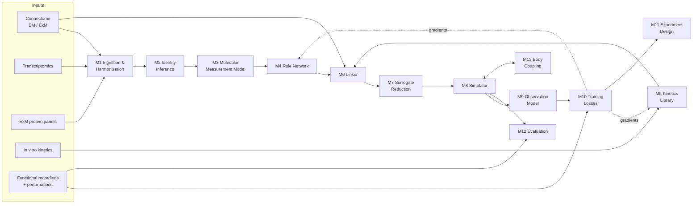

# Molecular Compiler for Whole-Brain Emulation: Technical Specification

*Engineering specification for the system described in "A Molecular Compiler for Whole-Brain Emulation." The framework document explains why each design choice is made; this document specifies what to build.*

*Revision 3 (2026-10-06): incorporates an external technical review, a literature check of every reference, and the implementation-stack decision. See [Revision history](#14-revision-history).*

---

## Contents

1. [Purpose and Scope](#1-purpose-and-scope)
2. [System Overview](#2-system-overview)
3. [Notation](#3-notation)
4. [Data Specification](#4-data-specification)
5. [Module Specifications](#5-module-specifications)
6. [Training Specification](#6-training-specification)
7. [Public Interfaces](#7-public-interfaces)
8. [Compute and Memory Budgets](#8-compute-and-memory-budgets)
9. [Evaluation Specification](#9-evaluation-specification)
10. [Delivery Phases](#10-delivery-phases)
11. [Risks and Mitigations](#11-risks-and-mitigations)
12. [Open Decisions](#12-open-decisions)
13. [References](#13-references)
14. [Revision history](#14-revision-history)

---

## 1. Purpose and Scope

### 1.1 Purpose

Build a system that takes the static anatomy and molecular composition of a nervous system and produces a runnable simulation whose activity, stimulus responses, and single-neuron perturbation responses match the real animal.

### 1.1a Scope of the claim

The central bet is that **connectome geometry × a compositional molecular rule** is enough to predict activity and single-neuron perturbation responses without per-animal functional fitting. Phase 0 (Section 10) exists to falsify that bet cheaply.

What a successful system delivers is a **compiled functional atlas**: a noise-ceiling-normalized match to spontaneous statistics, stimulus responses, and state-conditioned perturbation responses. It is not whole-brain emulation in the sense of memory, development, or open-ended behavior (see NG1–NG4). Closed-loop locomotion is a Phase 3 goal and is not part of the Phase 1 exit.

Only two learned components are allowed to transfer between animals and species: the rule network (M4) and the kinetics library (M5). Residuals $\varepsilon_s$ and identity deviations $\delta_i$ absorb within-animal variation and are disabled for every headline result.

### 1.2 Goals

| ID | Goal |
|---|---|
| G1 | Compile a runnable simulation from connectome + molecular data, with no per-animal functional fitting required |
| G2 | Learned rule parameters independent of neuron count $N$ |
| G3 | Simulation cost linear in $N$ and synapse count per timestep |
| G4 | Transfer across species with zero-shot or few-shot functional data |
| G5 | Predict state-conditioned responses to single-neuron perturbation on held-out neurons and neuron classes |
| G6 | Output ranked recommendations for the next experiments (stimulation targets, mutants, ExM panels) |

### 1.3 Non-goals

| ID | Non-goal | Reason |
|---|---|---|
| NG1 | Long-term learning and memory formation | Requires a model of $z(t)$ over hours; out of scope for the first system |
| NG2 | Development and growth | Connectome is treated as fixed within an emulation window |
| NG3 | Full morphological (multi-hundred-compartment) simulation at run time | Replaced by compile-time compartment reduction |
| NG4 | Glial dynamics | Deferred; residual analysis (M10) will flag if needed |
| NG5 | Building new connectome segmentation pipelines | Consume existing proofread connectomes |

### 1.4 Target systems

| System | Role | Neurons (approx.) | Chemical synapses (approx.) |
|---|---|---|---|
| *C. elegans* (hermaphrodite) | Primary training and validation | 302 | thousands; graph of 4,887 chemical and 1,447 gap-junction edges (Cook et al. 2019) |
| *Drosophila* optic lobe | First transfer target | ~53,000 in 727 types (male optic lobe; Nern et al. 2025) | millions |
| *Drosophila* whole brain | Full transfer target | 139,255 (FlyWire; Dorkenwald et al. 2024) | ~50 million |
| Larval zebrafish | First vertebrate | ~100,000 | to be determined by dataset |
| Mouse | Long-term target | ~70 million | ~$10^{11}$ |

---

## 2. System Overview

### 2.1 Pipeline



### 2.2 Stages

| Stage | Modules | Runs | Output |
|---|---|---|---|
| **Prepare** | M1, M2, M3 | Once per dataset | Harmonized graph with posterior molecular identities |
| **Compile** | M4, M5, M6, M7 | Once per animal (and per state configuration) | `SimGraph`: all simulation parameters + surrogates |
| **Run** | M8, M9, M13 | Per experiment | Simulated activity and predicted measurements |
| **Learn** | M10 | Iteratively | Updated rule network and kinetics |
| **Decide** | M11, M12 | After each training cycle | Benchmark scores and ranked next experiments |

### 2.3 Design principles

1. **Geometry × molecules.** Every parameter is a measured geometric gate times a learned molecular rule.
2. **Compositional rules.** Learn per-molecule parts, never whole-neuron or whole-synapse lookup tables.
3. **Compile time vs. run time.** Expensive mechanistic modeling happens once per molecular type; run time uses reduced surrogates.
4. **Uncertainty is first-class.** Identity, connectome edges, and measurement gains are distributions, not point values.
5. **Zero-shot is the headline.** Any reported claim about the compiler uses held-out data with residuals disabled.
6. **Wiring is not the only path.** Neuropeptide signaling between neurons without a synapse is modeled as its own pathway, gated by peptide and receptor expression rather than by anatomical edges (M4 peptidergic head).

---

## 3. Notation

| Symbol | Meaning | Shape / units |
|---|---|---|
| $N$ | Number of neurons | scalar |
| $\text{nnz}$ | Number of chemical synapses | scalar |
| $i, j$ | Neuron indices | — |
| $s$ | Synapse index | — |
| $c$ | Channel type index | — |
| $r$ | Receptor type index | — |
| $z_i$ | Molecular identity embedding of neuron $i$ | $\mathbb{R}^{d_z}$ |
| $e_s$ | Synapse feature vector | $\mathbb{R}^{d_e}$ |
| $S_s$ | Geometric gate of synapse $s$ (contact size) | µm² or synapse-count units |
| $a_{ij}$ | Membrane contact area between $i$ and $j$ | µm² |
| $\rho_{ic}$ | Density of channel $c$ in neuron $i$ | relative units, $\geq 0$ |
| $\bar g_c$ | Maximal conductance per unit density | nS |
| $a_c(V,t)$ | Gating state of channel $c$ | $[0,1]$ |
| $E_c, E_r$ | Reversal potentials | mV |
| $o_r(t)$ | Open probability of receptor $r$ | $[0,1]$ |
| $c(t)$ | Global modulator concentrations | $\mathbb{R}^{P}$ |
| $m_i(t)$ | Intracellular signaling state | $\mathbb{R}^{k}$ |
| $\varepsilon_s$ | Per-synapse residual (log-scale) | scalar |
| $\delta_i$ | Per-neuron identity deviation | $\mathbb{R}^{d_z}$ |
| $g_i$ | Indicator gain / saturation of neuron $i$ | parameters of $g_i(\cdot)$ |
| $d_j$ | Optogenetic drive of neuron $j$ | scalar |
| $\pi$ | Neuropeptide index | — |
| $P_\pi$ | Number of neuropeptide channels modeled | scalar |
| $\mathcal{E}_{\text{pep}}$ | Candidate peptidergic pairs $(j, i, \pi)$: $j$ expresses peptide $\pi$, $i$ expresses a cognate receptor | set |
| $\mathcal{L}_{\text{gap}}$ | Weighted graph Laplacian of gap-junction conductances | sparse $N n_{\text{comp}} \times N n_{\text{comp}}$ |
| $X$ | Molecular design matrix: rows for chemical synapses, gap-junction contacts, and peptidergic pairs | $(\text{nnz} + n_{\text{gap}} + \lvert\mathcal{E}_{\text{pep}}\rvert) \times (2d_z + d_e)$ |
| $T$ | Number of molecular types | scalar |
| $L$ | Sequence length (timesteps) | scalar |

---

## 4. Data Specification

### 4.1 Storage formats

| Data class | Format | Rationale |
|---|---|---|
| Tabular entities (neurons, synapses, contacts, genes) | Apache Parquet | Columnar, typed, scales to ~$10^{11}$ rows with partitioning |
| Time series (recordings, simulations) | Zarr (chunked) or NWB | Chunked random access; NWB for interchange with neurophysiology tools |
| Model checkpoints | Framework-native (e.g., Orbax / safetensors) | — |
| Configuration | YAML, validated against a JSON Schema | Reproducibility |

All quantities carry explicit units in schema metadata. All datasets carry a `dataset_id`, `species`, `animal_id`, and provenance record (source, version, processing hash).

### 4.2 Connectome schema

**`neurons`**

| Field | Type | Description |
|---|---|---|
| `neuron_id` | int64 | Unique within dataset |
| `animal_id` | string | Source animal |
| `type_label` | string, nullable | Annotated cell type, if available |
| `soma_xyz` | float32[3] | µm, dataset coordinate frame |
| `morphology_ref` | string, nullable | Pointer to skeleton / mesh |
| `segmentation_confidence` | float32 | $[0,1]$ |

**`synapses`**

| Field | Type | Description |
|---|---|---|
| `synapse_id` | int64 | Unique within dataset |
| `pre_id`, `post_id` | int64 | Foreign keys to `neurons` |
| `size` | float32 | Gate $S_s$ (cleft area or count proxy) |
| `vesicle_count` | float32, nullable | — |
| `xyz` | float32[3] | µm |
| `path_dist_post` | float32 | µm, path distance from synapse to postsynaptic integration zone |
| `local_diameter_post` | float32 | µm, neurite diameter at synapse |
| `compartment_post` | int16 | Compartment index after reduction (filled by M6) |
| `nt_pred` | float32[n_nt], nullable | Predicted neurotransmitter probabilities from EM |
| `detection_confidence` | float32 | $[0,1]$; used by the connectome error model |

**`contacts`** (membrane adjacency; used for gap junctions and the error model)

| Field | Type | Description |
|---|---|---|
| `i_id`, `j_id` | int64 | Neuron pair |
| `area` | float32 | µm² |
| `gap_junction_observed` | bool, nullable | Null where EM resolution cannot determine it |

### 4.3 Molecular schema

**`expression`** (type-level or cell-level)

| Field | Type | Description |
|---|---|---|
| `unit_id` | string | Cell or cell-type identifier |
| `unit_level` | enum {`cell`, `type`} | — |
| `gene_id` | string | Species-native gene identifier |
| `value` | float32 | Normalized expression (e.g., TPM or scaled counts) |
| `assay` | enum {`scRNA`, `bulk`, `ExSeq`, `ExM_protein`} | — |
| `subcellular` | enum {`soma`, `synapse`, `neurite`, `whole`} | Location, where resolved |

**`genes`**

| Field | Type | Description |
|---|---|---|
| `gene_id` | string | — |
| `species` | string | — |
| `protein_seq` | string | Canonical isoform sequence |
| `isoforms` | list[string] | Alternative isoform sequences |
| `ortholog_group` | string, nullable | Cross-species ortholog cluster |
| `molecule_class` | enum {`channel`, `receptor`, `transporter`, `innexin`, `peptide`, `gpcr`, `effector`, `other`} | Determines which head of M4 consumes it |
| `plm_embedding` | float16[d_plm] | Protein language model embedding (precomputed) |

**`peptide_receptor_pairs`** (ligand–receptor map for the peptidergic pathway)

| Field | Type | Description |
|---|---|---|
| `peptide_gene_id` | string | Precursor gene (e.g., *flp*, *nlp* family members) |
| `receptor_gene_id` | string | Cognate GPCR |
| `ec50_nM` | float32, nullable | Potency where measured |
| `evidence` | enum {`in_vitro_screen`, `in_vivo`, `predicted`} | e.g., the deorphanization screen of Beets et al. (2023) |
| `source` | string | Literature or database reference |

For *C. elegans*, this table is seeded from Beets et al. (2023), and the derived peptide network is checked against the neuropeptidergic connectome of Ripoll-Sánchez et al. (2023).

### 4.4 Functional data schema

**`recordings`** (Zarr / NWB)

| Field | Type | Description |
|---|---|---|
| `y` | float32[N_obs, L] | Fluorescence traces |
| `y_ref` | float32[N_obs, L], nullable | Static reference fluorophore (ratiometric) |
| `neuron_map` | int64[N_obs] | Matched `neuron_id`, with `match_confidence` |
| `t` | float64[L] | Seconds |
| `indicator` | string | e.g., GCaMP variant; selects $k_{\text{GCaMP}}$ |
| `prep` | enum {`immobilized`, `freely_moving`} | Sets boundary condition (M13) |
| `animal_state` | dict | e.g., fed / starved, arousal annotations |

**`stimulations`**

| Field | Type | Description |
|---|---|---|
| `t_on`, `t_off` | float64 | Seconds |
| `target_id` | int64 | Stimulated neuron |
| `wavelength_nm`, `power` | float32 | — |
| `opsin` | string | — |
| `opsin_expression` | float32, nullable | From the opsin's fluorescent tag, if measured |

**`behavior`** (optional): posture, velocity, and body-state time series aligned to `t`.

### 4.5 Kinetics library schema

One record per molecule (channel, receptor, transporter).

| Field | Type | Description |
|---|---|---|
| `molecule_id` | string | Links to `genes.gene_id` / `ortholog_group` |
| `model_form` | enum {`HH`, `markov`, `ligand_gated`, `gpcr`, `transporter`} | `gpcr`: binding plus downstream effector with onset/offset time constants, used by the peptidergic pathway |
| `params_prior_mean`, `params_prior_cov` | float32[], float32[,] | From in vitro data |
| `ion_selectivity` | dict | Permeability ratios (for $E$ computation) |
| `source` | string | Literature or database reference |
| `temperature_C` | float32 | For $Q_{10}$ correction |

### 4.6 Data splits

Splits are defined once, stored with the dataset, and never changed after Phase 0.

| Split | Held out | Tests |
|---|---|---|
| `leave_animal_out` | Whole animals | Variability across individuals |
| `leave_neuron_out` | Stimulation targets and/or recorded neurons | Within-animal generalization |
| `leave_class_out` | Entire neuron classes | Compositional extrapolation |
| `leave_state_out` | An internal state (e.g., starved) | Neuromodulation model |
| `leave_species_out` | Whole species | Cross-species transfer |

**Class definition for `leave_class_out`.** The class partition is pre-registered in Phase 0 and frozen with the splits.
- *C. elegans*: the 118 canonical neuron classes resolved by CeNGEN (Taylor et al. 2021). Bilateral homologs and radial members of a class are always held out together; holding out one cell of a left/right pair is a `leave_neuron_out` test, not a class test.
- *Drosophila*: cell types from Schlegel et al. (2024) / Nern et al. (2025), with the same rule for bilateral and columnar repeats.

**Split diagnostics.** Every `leave_class_out` report also states:
1. The fraction of genes expressed in held-out classes that are never expressed (above the M4 masking threshold) in any training class.
2. Whether each held-out class's expression profile lies inside the convex hull of training classes, and its distance to the nearest training class.
3. The effective number of independent expression contrasts in the training split (participation ratio of the singular values of $X$ restricted to training rows), alongside $\text{rank}_\epsilon(X)$.

A held-out class that sits inside the training hull and introduces no new genes tests interpolation, not compositional extrapolation, and is reported as such.

---

## 5. Module Specifications

Each module lists its purpose, inputs, outputs, method, and requirements. Requirement IDs (e.g., `M4-R3`) are referenced by tests.

### M1. Ingestion and Harmonization

**Purpose.** Convert source datasets into the schemas of Section 4.

| | |
|---|---|
| **Inputs** | Raw connectome exports, expression matrices, recordings, stimulation logs, kinetics sources |
| **Outputs** | Validated Parquet / Zarr datasets with provenance |

**Requirements.**
- `M1-R1` Every field is validated against the schema, including units; ingestion fails loudly on violation.
- `M1-R2` Gene identifiers are mapped to `ortholog_group` where available; unmapped genes are retained, not dropped.
- `M1-R3` Recording-to-connectome neuron matches carry a `match_confidence`; matches below a configurable threshold are excluded from training losses but retained for audit.
- `M1-R4` Every output records a processing hash so any result can be traced to its exact inputs.

### M2. Identity Inference

**Purpose.** Assign each connectome neuron a posterior over molecular identity, $p(z_i \mid \text{data})$.

| | |
|---|---|
| **Inputs** | `neurons`, `synapses`, `expression` (type-level), `nt_pred`, any same-tissue ExM/ExSeq |
| **Outputs** | Per neuron: posterior over type assignment, mean $z_i$, deviation $\delta_i$ prior, uncertainty |

**Method.**
1. Build a similarity structure within each modality: connectivity fingerprints for connectome neurons, expression similarity for transcriptomic types.
2. Align the two with fused Gromov–Wasserstein optimal transport. Fused terms use shared markers (predicted neurotransmitter, known marker genes, existing type labels).
3. Where same-tissue ExM/ExSeq exists, use those neurons as anchors with fixed assignments and to calibrate the transport cost.
4. Output the transport plan as a soft assignment; $z_i = \sum_t \pi_{it}\, z_t + \delta_i$.

**Requirements.**
- `M2-R1` When type labels already exist with high confidence (e.g., *C. elegans* with NeuroPAL), M2 passes them through with near-zero assignment entropy.
- `M2-R2` Assignment uncertainty propagates downstream by sampling assignments (default: 8 samples per compile in evaluation mode).
- `M2-R3` On anchor neurons held out from alignment, report assignment accuracy.

### M3. Molecular Measurement Model

**Purpose.** Map measured expression to protein-level, location-specific abundance.

| | |
|---|---|
| **Inputs** | $z^{\text{mRNA}}$ from M2; ExM protein measurements where available |
| **Outputs** | Estimated protein abundance per molecule, per neuron (and per compartment where resolved), with uncertainty |

**Method.** A per-molecule-class regression $z^{\text{mRNA}} \to \rho^{\text{protein}}$ with heteroscedastic noise, trained on cells with paired measurements. Isoform usage is represented where transcript-level data exist.

**Requirements.**
- `M3-R1` Without paired protein data, M3 defaults to an identity map with inflated uncertainty, never to a confident guess.
- `M3-R2` M3 exposes per-molecule predictive uncertainty to M11 so ExM panels can be chosen by information.

### M4. Rule Network (compiler core)

**Purpose.** Predict densities and per-synapse quantities from molecular identity and local features. This is the only module whose learned parameters must transfer across species.

| | |
|---|---|
| **Inputs** | Neuron identities $z_i$ (from M2/M3), synapse features $e_s$, contact areas $a_{ij}$, signaling state $m_i$ |
| **Outputs** | Channel densities, receptor densities, transporter densities, gap junction conductances, release and sensitivity profiles, short-term plasticity parameters |

**Architecture.**

1. **Gene tokens.** Each gene $g$ is represented as $u_g = W_{\text{plm}}\, \text{plm}(g) + b_{\text{ortholog}(g)}$, where the ortholog offset is shared within an ortholog group and softly tied by an L2 penalty.
2. **Neuron encoder.** A permutation-invariant set encoder over expressed genes, weighted by abundance: $z_i = \text{SetEnc}\big(\{(u_g, \rho^{\text{protein}}_{ig})\}_g\big) \in \mathbb{R}^{d_z}$.
3. **Optional context.** $0$–$2$ message-passing layers over the connectome. Default $0$; enabled only if ablations show benefit on `leave_class_out`, since neighbor context can weaken compositional extrapolation.
4. **Heads.** All density outputs pass through softplus and are **structurally masked**: a density is zero unless the corresponding gene is expressed above a threshold.

| Head | Output | Form |
|---|---|---|
| Channel | $\rho_{ic}$ for each channel gene $c$ | $\text{softplus}(h_c(z_i)) \cdot \mathbb{1}[\text{expressed}_{ic}]$ |
| Receptor | $\rho_{r,s}$ per synapse | $\text{softplus}(h_r(z_{\text{post}}, e_s)) \cdot \mathbb{1}[\text{expressed}] \cdot \mathbb{1}[\text{ligand}_r \in \text{released}_{\text{pre}}]$ |
| Transporter | Transporter densities → intracellular ion concentrations | Feeds reversal potentials in M6 |
| Gap junction | $G_{ij}$ | $a_{ij} \cdot \text{softplus}(z_i^\top H z_j)$, with $H$ symmetric |
| Peptidergic (fast, directed) | Per-peptide release gain $p_{j\pi}$; per-receptor sensitivity $q_{i\pi}$; effector coupling to conductances or intrinsic currents | $p_{j\pi} = \text{softplus}(h^{\text{rel}}_\pi(z_j)) \cdot \mathbb{1}[j \text{ expresses } \pi]$; $q_{i\pi} = \sum_{r \in \text{rec}(\pi)} \text{softplus}(h^{\text{sens}}_r(z_i)) \cdot \mathbb{1}[i \text{ expresses } r]$ |
| Neuromodulation (slow) | Release rates, sensitivity $R(z_i)$, effector map $\eta(z_i)$ onto signaling state $m_i$ | Masked by peptide / GPCR / effector expression |
| Short-term plasticity | $U, \tau_{\text{rec}}, \tau_{\text{fac}}$ per synapse | Bounded by sigmoid to physiological ranges |

**Peptidergic pathway.** Randi et al. (2023) found that signal propagation in the worm head departs from anatomical predictions, and that dense-core-vesicle-dependent signaling produces acute calcium responses (seconds or faster) between neurons with no wired connection, where the relevant peptides and receptors are expressed. The peptidergic head represents this directly: neuron $j$ releases peptide $\pi$ in proportion to $p_{j\pi}\, g_\pi(x_j)$, and neuron $i$ responds through receptor kinetics from M5 scaled by $q_{i\pi}$, **whether or not a synapse $j \to i$ exists**. Receptor kinetics are taken from the GPCR's M5 record, not fixed to a slow timescale. The optional spatial kernel (none, compartment-local, or decay length $\ell_\pi$) follows the short-, mid-, and long-range variants of Ripoll-Sánchez et al. (2023).

The slow neuromodulation head and its $k$-dimensional signaling state $m_i$ are kept for state changes over minutes, such as fed vs. starved.

Whether the peptidergic pathway is needed is an empirical question to settle in Phase 0, not an assumption. Creamer, Leifer & Pillow (2024) fit a connectome-constrained model to the same perturbation atlas. It reproduced most of the reproducible response structure, and adding connections not in the anatomy did not improve it. Phase 0 kill criterion K2 (Section 10) runs the comparison both ways.

5. **Species adapter.** Low-rank adapters on head weights, $W \to W + A_{\text{species}} B_{\text{species}}$ with rank $r_{\text{adapt}}$. Disabled for zero-shot evaluation.

**Requirements.**
- `M4-R1` Trainable parameter count (excluding adapters) is set from the Phase 0 rank analysis and must not exceed the configured fraction of $\text{rank}_\epsilon(X)$.
- `M4-R2` Output is invariant to neuron permutation (tested).
- `M4-R3` Masking is exact: an unexpressed molecule never receives nonzero density (tested).
- `M4-R4` The network evaluates synapse-level heads only on existing edges; cost $\mathcal{O}(\text{nnz})$.
- `M4-R5` Peptidergic heads are **not** restricted to anatomical edges. Their mask is (source expresses $\pi$) × (target expresses a receptor $r$ paired with $\pi$ in `peptide_receptor_pairs`). Cost is $\mathcal{O}(N \cdot P_\pi)$ through the factorized release/sensitivity form, never $\mathcal{O}(N^2)$.
- `M4-R6` Gene tokens for neuropeptide **ligands** are not assumed transferable across species. Neuropeptide families such as *flp* and *nlp* show lineage-specific expansion and limited one-to-one orthology. Conservation is clearer at the receptor level (Jékely 2013; Mirabeau & Joly 2013). For zero-shot transfer, peptidergic coupling is parameterized through receptor tokens, and ligand–receptor pairing comes from each species' own `peptide_receptor_pairs` table.

### M5. Kinetics Library

**Purpose.** Hold one kinetic model per molecule, shared across neurons and species.

| | |
|---|---|
| **Inputs** | Kinetics records (Section 4.5) |
| **Outputs** | Differentiable gating / binding / transport functions with parameters $\theta_{\text{mol}}$ |

**Method.** Hodgkin–Huxley or Markov gating for channels; ligand-gated binding schemes for receptors; electrogenic or electroneutral transport for transporters. Parameters are initialized at the in vitro prior mean and refined during training under a Mahalanobis prior penalty. Temperature is corrected with $Q_{10}$.

**Requirements.**
- `M5-R1` Every molecule with nonzero density in any compiled graph has a kinetic model; molecules without in vitro data use the prior of their nearest family member (by PLM embedding) with inflated covariance.
- `M5-R2` Refined parameters are reported with their deviation from the in vitro prior; large deviations are flagged for review.

**Degeneracy.** Very different channel-density and kinetic combinations can produce nearly identical activity (Prinz, Bucher & Marder 2004; Goaillard & Marder 2021). Simulation-based inference recovers broad, compensating parameter sets even in well-characterized circuits (Gonçalves et al. 2020). Refined kinetic parameters are therefore reported as *consistent with the data*, never as measurements, and deviations from the prior are interpreted only along directions the data constrain.

### M6. Linker

**Purpose.** Assemble all outputs into a runnable `SimGraph`.

| | |
|---|---|
| **Inputs** | M4 densities, M5 kinetics, connectome geometry, modulatory state configuration |
| **Outputs** | `SimGraph` (Section 7.2) |

**Method.**
1. **Compartment reduction.** Cluster each neuron's arbor into at most $n_{\text{comp}}$ electrotonic compartments. Membrane resistance $R_m$ comes from leak and resting conductances (M4/M5); axial resistance $R_a$ is a global parameter. Length constant $\lambda = \sqrt{R_m d / (4 R_a)}$. Each synapse gets attenuation $A_s = e^{-d_s/\lambda}$ to its compartment.
2. **Reversal potentials.** Compute intracellular ion concentrations from transporter densities, then $E_X = \frac{RT}{zF} \ln \frac{[X]_o}{[X]_i}$ (Nernst), or the Goldman–Hodgkin–Katz equation for mixed-permeability receptors using `ion_selectivity`.
3. **Connectome error model.** Gap junctions not observed in EM are added with expected conductance from the gap junction head; synapses below detection confidence are down-weighted by their posterior existence probability.
4. **Assembly.** Store per-synapse parameters sorted by postsynaptic neuron (CSR layout) for segment-sum accumulation.

**Requirements.**
- `M6-R1` Synaptic sign is never stored; it emerges from $E_r$ and $V$ at run time (tested: no sign field in `SimGraph`).
- `M6-R2` Linking is $\mathcal{O}(\text{nnz} + N)$.
- `M6-R3` **Sign audit.** M6-R1 is an invariant, not an identifiability guarantee. Sign depends on two things: receptor type, and for anion channels the intracellular chloride set by transporters. In *C. elegans*, GABA acts through both inhibitory anion channels and the excitatory cation channel EXP-1 (Beg & Jorgensen 2003). Glutamate acts through both excitatory GLR receptors and inhibitory glutamate-gated chloride channels (e.g., AWC → AIY; Chalasani et al. 2007). Loss of the K–Cl cotransporter KCC-2 makes normally inhibitory chloride currents excitatory (Tanis et al. 2009). For every compiled graph, M6 sweeps $[\text{Cl}^-]_i$ over its prior range and labels each synapse `sign_stable` or `sign_ambiguous`. The fraction of ambiguous edges is reported, and perturbation-sign metrics (Section 9.1) are reported separately for the two groups.

### M7. Surrogate Reduction

**Purpose.** Replace stiff conductance-based neuron models with fast reduced models at run time.

| | |
|---|---|
| **Inputs** | Full compositional neuron models from M6, clustered into $T$ molecular types |
| **Outputs** | One surrogate per type, with a validity envelope |

**Method.** Cluster neurons by $z$ into $T$ types. For each type, sample input currents spanning the range observed in simulation, run the full model, and fit a reduced model (2–4 state variables, or a small neural ODE) to the input–output mapping. Record the sampled input range as the validity envelope.

**Requirements.**
- `M7-R1` Surrogate error on held-out inputs is below tolerance $\tau_{\text{sur}}$ (configurable) or the type falls back to the full model.
- `M7-R2` At run time, any neuron whose inputs leave its envelope is switched to the full model and logged.
- `M7-R3` Surrogate fitting cost is $\mathcal{O}(T)$, independent of $N$.
- `M7-R4` Neuromodulation changes intrinsic dynamics, not just synaptic drive (Marder 2012). Surrogates are therefore **conditioned on modulatory state**: inputs are $(I_{\text{syn}}, c, m_i, \text{peptidergic drive})$, and the validity envelope covers all of these. A neuron whose modulatory state falls outside the sampled envelope runs the full model. Until conditioned surrogates pass M7-R1, every neuron under a non-default modulatory configuration runs the full model, which is mandatory for `leave_state_out` and G5 evaluations.

### M8. Simulator

**Purpose.** Integrate the compiled dynamics, differentiably.

**State layout.**

| State | Shape |
|---|---|
| Membrane potential | $N \times n_{\text{comp}}$ |
| Gating variables (or surrogate state) | $N \times n_{\text{gate}}$ |
| Receptor open states | $\text{nnz} \times n_{\text{rstate}}$ |
| Short-term plasticity | $\text{nnz} \times 2$ |
| Modulator field | $P$ (global mode) or $P \times n_{\text{grid}}$ (grid mode) |
| Signaling state | $N \times k$ |

**Numerics.**
- Gating variables: Rush–Larsen (exponential) integration.
- Voltage: semi-implicit (backward Euler) update for stability with stiff conductances. Gap junctions and axial coupling between compartments link voltages across neurons, so the update is a **sparse linear solve**, not a per-neuron update:
  $$\Big(\tfrac{C}{\Delta t} + D(t) + \mathcal{L}_{\text{gap}} + \mathcal{L}_{\text{axial}}\Big)\, V^{n+1} = \tfrac{C}{\Delta t} V^n + b(t),$$
  where $D(t)$ is the diagonal of channel and synaptic conductances linearized at step $n$. The matrix is symmetric positive definite.
  - **Small graphs** (*C. elegans*: $302 \times n_{\text{comp}} \approx 900$ unknowns at the default $n_{\text{comp}} = 3$): dense Cholesky, refactored each step because $D(t)$ changes. This is sub-millisecond on a GPU or CPU and avoids sparse-factorization support entirely. Warm-started CG is an acceptable alternative if benchmarks favor it.
  - **Large graphs**: preconditioned conjugate gradient with a block-Jacobi (per-neuron) preconditioner, warm-started from $V^n$, to a configured relative tolerance.
  - **Gradients**: implicit differentiation of the solve (an adjoint solve with the same matrix), not unrolled CG iterations.
- Synaptic input: sparse matrix–vector product via segment sum over postsynaptic CSR layout.
- Peptidergic input: factorized $\mathcal{O}(N \cdot P_\pi)$ release/sensitivity product (M4-R5), with GPCR effector states integrated by Rush–Larsen.
- Neuromodulation: **global mode** uses the low-rank factorization $q_i^\top Q\big(\sum_j p_j\, g(x_j)\big)$; **grid mode** uses a sparse diffusion stencil or FFT convolution with decay length $\ell$. Mode is selected per species by configuration.
- Timestep $\Delta t$ is configured per species (graded-potential systems tolerate larger steps than spiking systems).

**Execution modes.**

| Mode | Use | Notes |
|---|---|---|
| `sequential` | Reference runs, long free runs | Exact time stepping |
| `event` | Large spiking systems | Synaptic work scales with spike count |
| `parallel` | Training windows (experimental) | Parallel-in-time quasi-Newton with parallel scan (DEER / quasi-DEER / ELK; Lim et al. 2024; Gonzalez et al. 2024); falls back to `sequential` if not converged in $n_{\text{newton}}$ iterations |

**Training throughput is planned on `sequential` mode with short-window multiple shooting.** `parallel` mode is research machinery whose convergence on stiff conductance models coupled by gap junctions is unproven: full DEER has cubic cost in state dimension and can be numerically unstable, and the stabilized variants trade that for more iterations. It is an optional accelerator, adopted only after Phase 1 benchmarks show a fallback rate below a configured threshold.

**Requirements.**
- `M8-R1` All modes produce matching trajectories within tolerance on a reference suite (tested).
- `M8-R2` Gradients are available in `sequential` and `parallel` modes.
- `M8-R3` Excluding the voltage solve, per-step cost is $\mathcal{O}(\text{nnz} + N \cdot (P + P_\pi))$ in global mode and $\mathcal{O}(\text{nnz} + N \cdot (P + P_\pi) + n_{\text{grid}})$ in grid mode. The solve costs $\mathcal{O}(N n_{\text{comp}} + n_{\text{gap}})$ per CG iteration. The iteration count is reported, not assumed constant.
- `M8-R4` Runs are deterministic given a seed. Default precision float32; reference validation runs in float64.
- `M8-R5` The voltage solve meets its residual tolerance at every step (logged). The float32 result matches a float64 direct solve on the reference suite, and gradients through the solve match finite differences.
- `M8-R6` Per-step cost including the gap-junction solve is reported separately from synaptic accumulation in all benchmarks.

### M9. Observation Model

**Purpose.** Map simulated state to what instruments measure, and model the stimulus.

**Method.**
1. Calcium: $\frac{d\,\text{Ca}_i}{dt} = -\frac{\text{Ca}_i}{\tau_{\text{Ca}}} + \gamma\, I_{\text{Ca},i}$, using calcium currents from the simulation.
2. Indicator: $y_i(t) = g_i\big((k_{\text{ind}} * \text{Ca}_i)(t)\big) + \text{noise}$, where $k_{\text{ind}}$ is fixed per indicator variant and $g_i$ is a saturating Hill function with per-neuron gain.
3. Ratiometric correction: when `y_ref` exists, the gain is informed by the reference channel.
4. Optogenetic drive: injected current $d_j \cdot \text{light}(t)$, with $d_j$ informed by `opsin_expression` when measured.

**Requirements.**
- `M9-R1` Per-neuron gains and drives are nuisance parameters; they never feed into M4.
- `M9-R2` Gauge is fixed (Section 6.3) whenever gains are not measured.

### M10. Training

Specified in Section 6.

### M11. Experiment Design

**Purpose.** Rank candidate experiments by expected information about the rules.

| | |
|---|---|
| **Inputs** | Ensemble of trained rule networks (posterior approximation), candidate catalog |
| **Outputs** | Ranked proposals with expected information gain and cost |

**Candidate types.**

| Candidate | Effect in the model |
|---|---|
| Stimulation target $j$ under state $s$ | New perturbation response data |
| Mutant strain | Modifies $z$ for affected neurons (gene knockout or overexpression) |
| Drug / antagonist | Modifies kinetics or masks a receptor |
| ExM panel | Reduces M3 uncertainty for chosen molecules |

**Method.** Approximate expected information gain by ensemble disagreement on the candidate's predicted observable (mutual information between prediction and model identity). Divide by cost to rank. Until the posterior decision in Section 12 is made, this score is labeled a **sensitivity proxy**, not an information gain (Section 6.5).

**Priority order.** Candidates are ranked first by which Phase 0 failure mode they address, and only then by the disagreement score:
1. **Peptidergic vs. wired transmission (K2).** Dense-core-vesicle release mutants (e.g., *unc-31*/CAPS), neuropeptide-processing mutants (e.g., *egl-3*, *egl-21*), and knockouts of individual peptides and receptors from `peptide_receptor_pairs`.
2. **Sign ambiguity (K3).** *kcc-2*, *exp-1*, and glutamate-gated chloride channel mutants that target `sign_ambiguous` edges.
3. **Collinearity (K1, K4).** Mutants and drugs that separate collinear gene pairs in $X$.
4. **ExM panels** that reduce M3 uncertainty on molecules driving the above.

**Requirements.**
- `M11-R1` Each proposal states which rule directions it constrains (e.g., which collinear gene pair it separates) and which kill criterion it informs.
- `M11-R2` The mutant catalog is restricted to strains that are commercially or publicly available.

### M12. Evaluation Harness

Specified in Section 9.

### M13. Body Coupling

**Purpose.** Close the loop between emulated brain and body for freely moving data.

**Interface.**
```python
class BodyModel(Protocol):
    def reset(self, state0: BodyState) -> SensoryInput: ...
    def step(self, motor: MotorOutput, dt_s: float) -> SensoryInput: ...
```

Adapters: a biomechanical worm body model and NeuroMechFly for *Drosophila*. Motor and sensory neurons are mapped to body actuators and sensors by configuration.

**Requirements.**
- `M13-R1` Every evaluation record states its boundary condition: `open_loop` (immobilized) or `closed_loop` (with body model).

---

## 6. Training Specification

### 6.1 Objective

$$
\mathcal{L} = \lambda_{\text{traj}}\, \mathcal{L}_{\text{traj}} + \lambda_{\text{stat}}\, \mathcal{L}_{\text{stat}} + \lambda_{\text{pert}}\, \mathcal{L}_{\text{pert}} + \lambda_{\text{prior}}\, \mathcal{L}_{\text{prior}}
$$

| Term | Definition |
|---|---|
| $\mathcal{L}_{\text{traj}}$ | Negative log-likelihood of observed $y$ over short windows of length $W$. Each window's initial state is inferred by an encoder from preceding data (multiple shooting). $W$ is set below the estimated Lyapunov time. |
| $\mathcal{L}_{\text{stat}}$ | Discrepancy between long free-run statistics and data: correlation matrices, power spectral densities, and state occupancy, measured with maximum mean discrepancy. |
| $\mathcal{L}_{\text{pert}}$ | For each (stimulated $j$, responding $i$, state bin $s$): energy distance between simulated and observed response distributions $R_{ij}(\tau \mid s)$. |
| $\mathcal{L}_{\text{prior}}$ | $\sum_s \varepsilon_s^2 / \sigma^2$; Gaussian prior on $\delta_i$; Mahalanobis distance of kinetics to in vitro priors; ortholog tie penalty on gene tokens. |

### 6.2 Residuals

- $\varepsilon_s$ and $\delta_i$ are enabled only for within-animal fitting.
- $\sigma^2$ is learned and reported every training cycle as the measure of unexplained variance.
- After each cycle, $\varepsilon_s$ is regressed on all synapse features not used by M4; features with significant predictive power are reported as candidate additions to $e_s$.

### 6.3 Gauge fixing

- Voltage is in mV (physical units); no state rescaling is permitted.
- When indicator gains are not measured: constrain the mean log-gain within each molecular type to zero.
- When opsin drive is not measured: estimate from the stimulated neuron's own response and constrain the mean log-drive within each type to zero.

**Cost of gauge fixing.** Constraining mean log-gain and log-drive to zero within each type removes the confound between type-level indicator brightness and type-level activity. It also removes any *true* type-level difference in response scale. Consequences:
- Amplitude metrics across types are not identifiable under this gauge and are reported only within types or after ratiometric correction.
- If the Phase 0 gauge audit finds that gain or opsin expression correlates with molecular identity, within-type amplitude metrics are distorted too, and are flagged in every report.
- The gauge audit must be completed **before** the parameter budget (M4-R1) is frozen.

### 6.4 Curriculum

| Stage | Data | Trained | Purpose |
|---|---|---|---|
| 0 | In vitro kinetics only | M5 | Verify kinetic models reproduce source data |
| 1 | Worm, immobilized, spontaneous | M4, M5, M9 | Basic dynamics, short windows |
| 2 | + perturbation atlas (incl. *unc-31* and peptide-mutant atlases where available) | + $\mathcal{L}_{\text{pert}}$; + peptidergic heads unless Phase 0 K2 eliminated them | Causal structure, wired and peptidergic |
| 3 | + long recordings | + $\mathcal{L}_{\text{stat}}$ | Long-horizon statistics |
| 4 | + multiple internal states | + neuromodulation heads | State dependence |
| 5 | + second species | + species adapters | Transfer |

### 6.5 Uncertainty

Train an ensemble of $K$ rule networks with independent initializations and data-order seeds. Deep ensembles can be read as approximate Bayesian model averaging (Lakshminarayanan et al. 2017; Wilson & Izmailov 2020), but with $K = 5$ the ensemble is a **sensitivity probe**, not a calibrated posterior. It is labeled that way in all reports and in M11 until the posterior approximation (Section 12) is chosen and its calibration checked on held-out data. Reported intervals are "ensemble range", not credible intervals.

### 6.6 Initial hyperparameters

These are starting values for Phase 1, to be revised by ablation.

| Parameter | Initial value |
|---|---|
| $d_z$ | 64 |
| Message-passing layers | 0 |
| $n_{\text{comp}}$ | 3 |
| Signaling dimension $k$ | 4 |
| Ensemble size $K$ | 5 |
| Window length $W$ | Below estimated Lyapunov time, set from Phase 0 data |
| Adapter rank $r_{\text{adapt}}$ | 4 |
| Optimizer | AdamW with gradient-norm clipping |
| Precision | float32 training; float64 reference checks |

---

## 7. Public Interfaces

### 7.1 Top-level API

```python
def prepare(
    connectome: ConnectomeDataset,
    molecular: MolecularDataset,
    anchors: ExMDataset | None = None,
) -> AnnotatedGraph:
    """M1–M3. Harmonize data and infer molecular identity posteriors."""

def compile(
    graph: AnnotatedGraph,
    rules: RuleNetwork,
    kinetics: KineticsLibrary,
    state: ModulatoryState | None = None,
    resolution: ResolutionPolicy = ResolutionPolicy.default(),
    identity_sample: int | None = None,
) -> SimGraph:
    """M4–M7. Produce a runnable simulation. Residuals are off unless
    explicitly attached with `attach_residuals`."""

def simulate(
    sim: SimGraph,
    stimulus: Stimulus,
    duration_s: float,
    mode: Literal["sequential", "event", "parallel"] = "sequential",
    body: BodyModel | None = None,
    seed: int = 0,
) -> Trajectory:
    """M8 (+ M13). Integrate the compiled dynamics."""

def observe(traj: Trajectory, obs: ObservationModel) -> Recording:
    """M9. Predict instrument measurements."""

def evaluate(
    rules: RuleEnsemble,
    kinetics: KineticsLibrary,
    split: Split,
    benchmarks: list[str],
) -> EvalReport:
    """M12. Zero-shot evaluation on held-out data."""

def propose_experiments(
    posterior: RuleEnsemble,
    candidates: CandidateCatalog,
    budget: float,
) -> list[Proposal]:
    """M11. Rank next experiments by information per unit cost."""
```

### 7.2 `SimGraph` contents

| Field | Shape | Description |
|---|---|---|
| `neuron_params` | $N \times n_{\text{comp}} \times \cdot$ | Densities, capacitance, reversal potentials, surrogate type |
| `surrogates` | $T$ entries | Reduced models + validity envelopes |
| `syn_post_ptr`, `syn_pre_idx` | CSR arrays | Synapse layout sorted by postsynaptic neuron |
| `syn_params` | $\text{nnz} \times n_{\text{sp}}$ | Gate, receptor densities, attenuation, compartment, STP parameters |
| `gap` | sparse $N \times N$ | Gap junction conductances (observed + predicted) |
| `neuromod` | — | Mode, release / sensitivity matrices, diffusion operator |
| `metadata` | — | Species, animal, rule-network checkpoint hash, identity sample index |

### 7.3 Implementation stack

**Decision: Python + JAX for the core, with a native-kernel layer added only when scale requires it.** This resolves the framework decision formerly open in Section 12.

| Layer | Language / tools | Modules | Phase |
|---|---|---|---|
| Core: rules, simulator, training | Python + JAX | M4–M10 | 1 |
| Data and ingestion | Python (pyarrow / polars, zarr, pynwb, pandera) | M1–M3, M12 | 0 |
| Hot kernels | Pallas / Triton, or CUDA/C++ via XLA custom calls | M8 event mode, segment sum, large-graph voltage solve | 2+ |
| Distributed simulation | JAX `shard_map` first; C++/CUDA + MPI (or Rust) only if that falls short | `C-R3` halo exchange | 4 |

**Why JAX fits this spec.**
- **Implicit gradients of the voltage solve** (M8-R5) map directly onto `jax.lax.custom_linear_solve` or lineax.
- **Batching.** $K$ ensemble members × identity samples (M2-R2) × training windows are a nested `vmap`, which also serves M11.
- **Parallel-in-time mode** builds on `lax.associative_scan`; the DEER-family methods (Lim et al. 2024; Gonzalez et al. 2024) have JAX implementations.
- **Determinism and precision.** Explicit PRNG keys satisfy M8-R4; float64 reference runs need a single configuration flag.
- **Optimal transport.** OTT-JAX provides fused Gromov–Wasserstein, so M2 can run on GPU and be differentiable. POT remains a fallback.
- **Sparse synaptic accumulation** is `jax.ops.segment_sum` over the postsynaptic CSR layout.
- **Style.** The spec's design (pure functions, `SimGraph` as data, scan-based time stepping) matches JAX's functional model.

**Constraints.**
- `S-R1` M4 → M8 → M9 → M10 is a single differentiable JAX program. No framework boundary is allowed inside the gradient path.
- `S-R2` External Python tools stay outside the gradient path. These include protein language model embeddings (precomputed into `genes.plm_embedding`), NWB I/O, NeuroMechFly / flygym (M13), and connectome tooling. Baseline B6 (flyvis, Lappalainen et al. 2024) is PyTorch and runs as a separate evaluation job.
- `S-R3` C++ or Rust is not used as a primary language. Native code is introduced only for profiled hot kernels (Phase 2+) or the distributed simulator (Phase 4), where it is justified.

**Alternatives considered.**
- **PyTorch** is viable and has the larger ecosystem and the flyvis precedent. But implicit linear-solve gradients, parallel scans, and ensemble batching each need more custom work.
- **Julia** (SciML: DifferentialEquations.jl, SciMLSensitivity, Enzyme, CHOLMOD) is arguably strongest for M5–M8 in isolation. It is weaker on the ML and data sides and has a smaller contributor pool. It would also put a Python↔Julia bridge in the gradient path. It remains an option for **offline** prototyping of stiff kinetics or surrogate fitting (M5/M7) if Phase 0 shows that is where the difficulty lies, since surrogates are fit at compile time and need not share the runtime framework.

---

## 8. Compute and Memory Budgets

Order-of-magnitude estimates assuming float32, about 18 floats of parameters and state per synapse (~72 bytes), and about 50 floats per neuron. To be replaced by measurements in Phase 1.

| System | Synapse memory | Neuron memory | Hardware class |
|---|---|---|---|
| *C. elegans* | < 1 MB | < 1 MB | Single GPU or CPU |
| *Drosophila* whole brain (~50M synapses) | ~3.6 GB | ~30 MB | Single GPU |
| Mouse (~$10^{11}$ synapses) | ~7 TB | ~15 GB | Multi-node, graph-partitioned |

**Throughput.** Synaptic updates are memory-bandwidth bound: each step reads the synapse arrays once. For the whole fly brain at $\Delta t = 0.1$ ms, a simulated second requires about $10^4$ passes over ~3.6 GB, on the order of tens of seconds of wall-clock time per simulated second on a single current-generation GPU. Event-driven mode reduces this in proportion to firing sparsity.

**Scaling requirements.**
- `C-R1` Per-step simulation cost scales linearly in $N$ and $\text{nnz}$ (verified by benchmarks on subsampled graphs).
- `C-R2` Rule-network parameter count is independent of $N$.
- `C-R3` For mouse-scale graphs, the simulator supports graph partitioning across devices with halo exchange of boundary neuron states each step.

---

## 9. Evaluation Specification

### 9.1 Metrics

All metrics are normalized by the data's noise ceiling (split-half reliability across trials or animals).

| Category | Metric |
|---|---|
| Spontaneous activity | Similarity of correlation matrices; power spectral density distance; state-occupancy divergence |
| Stimulus responses | Noise-ceiling-normalized explained variance of trial-averaged responses |
| Perturbation: detection | AUROC for classifying which neurons respond to stimulation of $j$ |
| Perturbation: sign | Accuracy of response sign (excitation vs. inhibition), reported separately for `sign_stable` and `sign_ambiguous` edges (M6-R3) and for pairs with vs. without a wired path |
| Perturbation: amplitude | Correlation of response amplitudes |
| Perturbation: timing | Latency error |
| Perturbation: state | Energy distance between simulated and observed response distributions per state bin |
| Diagnostics | Fitted $\sigma^2$; ensemble spread; kinetics deviation from in vitro priors |

### 9.2 Baselines

| ID | Baseline | Purpose |
|---|---|---|
| B0 | Connectome-only: weights from synapse counts, sign from predicted transmitter, uniform intrinsic dynamics | Does molecular information help at all? |
| B1 | Black-box kernel: same inputs, unstructured network instead of compositional heads | Does compositionality help extrapolation? |
| B2 | Structure-free data-driven model trained on the same recordings | Does anatomy help? |
| B3 | Per-animal fitted model with residuals enabled | Upper reference, not a target |
| B4 | Synapse-only compiler: the full compiler with peptidergic heads removed | Is non-wired transmission needed? (K2) |
| B5 | Connectome-constrained model fit to activity without molecular rules (e.g., Creamer et al. 2024 for worm; Pospisil et al. 2024 for fly) | Do molecular rules add anything beyond anatomy plus a data fit? |
| B6 | Task-trained connectome model (Lappalainen et al. 2024), fly optic lobe only | Does the compiler beat the strongest structure-based alternative? |

For context, Shiu et al. (2024) report that a whole-brain leaky integrate-and-fire *Drosophila* model, with weights from synapse counts and sign from predicted transmitter, predicts sensorimotor circuit activation. That is close to B0 at fly scale, so B0 is not a weak baseline.

### 9.3 Acceptance criteria

- The compiler outperforms **B0, B1, and B2** on `leave_class_out` perturbation metrics, with paired bootstrap 95% confidence intervals across neurons excluding zero. Residuals are off, and the class partition is the pre-registered one (Section 4.6). Beating B2 is required so that a win cannot come from a model that ignores the connectome.
- Results against B4 and B5 are always reported and do not gate acceptance.
- Numerical targets for each metric are set at the end of Phase 0, as a fraction of the noise ceiling.

### 9.4 Reporting requirements

Every reported result states: split, boundary condition, whether residuals were enabled (headline results: never), identity-sample averaging, ensemble size (labeled as a sensitivity probe, Section 6.5), fitted $\sigma^2$, gauge used, split diagnostics (Section 4.6), fraction of `sign_ambiguous` edges, and data processing hashes.

---

## 10. Delivery Phases

| Phase | Scope | Dependencies | Exit criteria |
|---|---|---|---|
| **0. Feasibility** | Rank analysis of $X$ on worm data; leave-class-out comparison of compositional vs. black-box heads; gauge audit of indicator and opsin expression by cell type; kill criteria K1–K4 below | Public worm data only (CeNGEN, NeuroPAL datasets, Randi et al. 2023 atlas, Beets et al. 2023 peptide–GPCR map) | Class partition and splits pre-registered and frozen; gauge audit complete; then rank estimate and parameter budget fixed; K1–K4 reported; metric targets set |
| **1. Worm compiler** | M1–M12 end to end on *C. elegans* | Phase 0 | Acceptance criteria (Section 9.3) met on `leave_neuron_out` and `leave_class_out`, **including B2**, residuals off, pre-registered classes; B4/B5 comparisons and $\sigma^2$ residual analysis reported |
| **2. Fly optic lobe transfer** | Zero-shot and few-shot transfer to the optic lobe | Molecularly annotated optic lobe (connectome: Matsliah et al. 2024, Nern et al. 2025; transcriptomics: Kurmangaliyev et al. 2020, Özel et al. 2021; ExM/ExSeq wet lab); functional recordings | Zero-shot result reported against B0 **and B6** (task-trained connectome model) on held-out neural activity, with no task loss and no functional fine-tuning; few-shot adapter gain quantified. **Transfer failure is an allowed, reportable outcome**; Phase 2 is not planned as the project headline |
| **3. Whole fly and closed loop** | Whole-brain *Drosophila*; M13 with NeuroMechFly; first zebrafish compile | Phase 2; body model integration | Closed-loop locomotion statistics match data; zebrafish zero-shot result reported |
| **4. Scale infrastructure** | Distributed simulator, grid-mode neuromodulation, graph partitioning | Phase 3 | `C-R1` verified up to the largest available connectome |

### 10.1 Phase 0 kill criteria

Each criterion has a pre-registered threshold, set before the analysis runs. Failing one doesn't end the project automatically, but it forces a documented design change before Phase 1 starts.

| ID | Test | Kills or changes |
|---|---|---|
| K1 | **Rank and parameter budget.** $\text{rank}_\epsilon(X)$ on worm data, setting M4-R1 | Compositional rules have too few independent directions to learn more than class-level averages |
| K2 | **Volume-transmission ablation.** On the Randi et al. (2023) perturbation atlas, compare B4 (synapse-only) with the peptide-aware compiler, separately for pairs with and without a wired path. Wild-type vs. *unc-31* data are used where available. | If the peptide-aware compiler wins, M4 peptidergic heads become mandatory from Stage 2. If it doesn't (consistent with Creamer et al. 2024), they are dropped from the Phase 1 critical path. Either outcome is a result. |
| K3 | **Sign audit.** Fraction of glutamate and GABA edges that are `sign_ambiguous` under the prior range of $[\text{Cl}^-]_i$ (M6-R3) | If large, sign metrics are not interpretable without chloride measurements, and K3-targeted mutants (M11) move to the top of the queue |
| K4 | **Class-split audit.** Effective number of independent expression contrasts in the training split, plus the hull and novel-gene diagnostics (Section 4.6) | If held-out classes are mostly interpolations, `leave_class_out` cannot support a compositionality claim, and the split or dataset must change |

---

## 11. Risks and Mitigations

| Risk | Signal | Mitigation |
|---|---|---|
| Molecular rules explain little | Large $\sigma^2$; B0 ≈ compiler | Residual analysis to find missing features; revisit $e_s$ |
| Collinearity caps learnable rules | Low $\text{rank}_\epsilon(X)$ | Mutant and drug experiments from M11; pool species |
| Compositional heads underfit | B1 beats compiler in-distribution | Add learned correction term with strong regularization |
| Gauge confound | Gains correlate with type in Phase 0 audit | Ratiometric imaging; opsin-tag measurement; gauge fixing |
| Parallel-in-time solver fails to converge | Frequent fallback to `sequential` | Shorten windows; precondition; accept slower training |
| Surrogates leave validity envelope often | High fallback rate in M7 logs | Widen sampled input range; increase surrogate capacity |
| Cross-species transfer fails | Large $\Delta_{\text{species}}$; zero-shot ≈ B0 | Report as a scientific result; few-shot path remains |
| Wet lab delays molecular annotations | Phase 2 blocked | Run Phase 2 with type-level transcriptomics first; upgrade when ExM data arrive |
| Non-wired (peptidergic) transmission dominates | B4 ≪ peptide-aware compiler on pairs without a wired path; residuals concentrate on those pairs | Peptidergic heads mandatory (K2); prioritize peptide and receptor mutants in M11. Do not misread residuals as "missing synapse features" |
| Sign not identifiable | High `sign_ambiguous` fraction (K3) | Report sign metrics split by stability; chloride-transporter mutants; measure $[\text{Cl}^-]_i$ where possible |
| Leave-class-out tests interpolation only | Held-out classes inside the training hull with no novel genes (K4) | Redefine classes or splits; report as interpolation |
| Surrogates fail under modulation | High M7 fallback rate in non-default states | State-conditioned surrogates (M7-R4); full model for state evaluations |
| Gap-junction solve dominates cost | Per-step solve time ≫ synaptic accumulation (M8-R6) | Better preconditioner; exploit the per-neuron block structure; reduce $n_{\text{comp}}$ |
| Ensemble overconfident | Held-out coverage of ensemble range below nominal | Treat as sensitivity probe only (Section 6.5); move to Laplace, variational, or simulation-based inference |
| Task-trained connectome models beat the compiler | B6 > compiler on held-out fly activity | Report it; analyze which cell types the task model gets right |

---

## 12. Open Decisions

| Decision | Options | Decide by |
|---|---|---|
| ~~Numerical framework~~ | **Decided (Rev. 3): Python + JAX.** See Section 7.3 | — |
| Protein language model for gene tokens | Choice of model and embedding layer | Phase 0 |
| Surrogate family | Fixed low-dimensional ODE vs. small neural ODE, both conditioned on modulatory state (M7-R4) | Phase 1 ablation |
| Posterior approximation | Deep ensemble vs. Laplace vs. variational vs. simulation-based inference (Gonçalves et al. 2020) | Phase 1 |
| Voltage solver at fly scale | Block-Jacobi PCG vs. incomplete Cholesky vs. domain decomposition; native kernel if JAX sparse support is insufficient (Section 7.3) | Phase 2 |
| Peptidergic spatial kernel | None vs. compartment-local vs. decay length $\ell_\pi$ | Phase 0 (K2) |
| $\Delta t$ and $n_{\text{comp}}$ per species | Set by convergence tests | Per phase |
| Message passing in M4 | 0 vs. 1–2 layers | Phase 1 ablation on `leave_class_out` |
| Data licensing and sharing | Per-dataset terms | Before ingestion |

---

## 13. References

*Checked against publisher records, PubMed, arXiv, and bioRxiv on 2026-10-06. Items marked † have volume, page, or DOI details recalled rather than read from the publisher record; confirm before formal citation.*

**Connectomes and cell types**
- Cook, S. J. et al. (2019). Whole-animal connectomes of both *Caenorhabditis elegans* sexes. *Nature* 571, 63–71. doi:10.1038/s41586-019-1352-7
- Dorkenwald, S. et al. (2024). Neuronal wiring diagram of an adult brain. *Nature* 634, 124–138. doi:10.1038/s41586-024-07558-y †
- Matsliah, A. et al. (2024). Neuronal parts list and wiring diagram for a visual system. *Nature* 634. doi:10.1038/s41586-024-07981-1
- Nern, A. et al. (2025). Connectome-driven neural inventory of a complete visual system. *Nature* 641. doi:10.1038/s41586-025-08746-0
- Schlegel, P. et al. (2024). Whole-brain annotation and multi-connectome cell typing of *Drosophila*. *Nature* 634. doi:10.1038/s41586-024-07686-5

**Molecular identity and expression**
- Eckstein, N. et al. (2024). Neurotransmitter classification from electron microscopy images at synaptic sites in *Drosophila melanogaster*. *Cell* 187(10), 2574–2594. doi:10.1016/j.cell.2024.03.016
- Gendrel, M., Atlas, E. G. & Hobert, O. (2016). A cellular and regulatory map of the GABAergic nervous system of *C. elegans*. *eLife* 5, e17686.
- Kurmangaliyev, Y. Z. et al. (2020). Transcriptional programs of circuit assembly in the *Drosophila* visual system. *Neuron* 108(6), 1045.
- Özel, M. N. et al. (2021). Neuronal diversity and convergence in a visual system developmental atlas. *Nature* 589, 88. doi:10.1038/s41586-020-2879-3
- Pereira, L. et al. (2015). A cellular and regulatory map of the cholinergic nervous system of *C. elegans*. *eLife* 4, e12432.
- Serrano-Saiz, E. et al. (2013). Modular control of glutamatergic neuronal identity in *C. elegans* by distinct homeodomain proteins. *Cell* 155(3), 659.
- Taylor, S. R. et al. (2021). Molecular topography of an entire nervous system. *Cell* 184(16), 4329–4347. doi:10.1016/j.cell.2021.06.023
- Wang, C. et al. (2024). A neurotransmitter atlas of *C. elegans* males and hermaphrodites. *eLife* 13, RP95402.
- Yemini, E. et al. (2021). NeuroPAL: a multicolor atlas for whole-brain neuronal identification in *C. elegans*. *Cell* 184(1), 272–288. doi:10.1016/j.cell.2020.12.012

**Neuropeptide signaling and synaptic sign**
- Beets, I. et al. (2023). System-wide mapping of peptide–GPCR interactions in *C. elegans*. *Cell Reports* 42(9), 113058.
- Beg, A. A. & Jorgensen, E. M. (2003). EXP-1 is an excitatory GABA-gated cation channel. *Nature Neuroscience* 6, 1145–1152. doi:10.1038/nn1136
- Chalasani, S. H. et al. (2007). Dissecting a circuit for olfactory behaviour in *Caenorhabditis elegans*. *Nature* 450. doi:10.1038/nature06292
- Jékely, G. (2013). Global view of the evolution and diversity of metazoan neuropeptide signaling. *PNAS* 110(21), 8702–8707.
- Mirabeau, O. & Joly, J.-S. (2013). Molecular evolution of peptidergic signaling systems in bilaterians. *PNAS* 110(22), E2028–E2037.
- Ripoll-Sánchez, L. et al. (2023). The neuropeptidergic connectome of *C. elegans*. *Neuron* 111(22), 3570–3589.
- Tanis, J. E. et al. (2009). The potassium chloride cotransporter KCC-2 coordinates development of inhibitory neurotransmission and synapse structure in *Caenorhabditis elegans*. *Journal of Neuroscience* 29(32), 9943–9954. †

**Functional data and whole-brain models**
- Atanas, A. A. et al. (2023). Brain-wide representations of behavior spanning multiple timescales and states in *C. elegans*. *Cell* 186(19).
- Creamer, M. S., Leifer, A. M. & Pillow, J. W. (2024). Bridging the gap between the connectome and whole-brain activity in *C. elegans*. *bioRxiv*. doi:10.1101/2024.09.22.614271
- Lappalainen, J. K. et al. (2024). Connectome-constrained networks predict neural activity across the fly visual system. *Nature* 634, 1132–1140. doi:10.1038/s41586-024-07939-3
- Mi, L. et al. (2022). Connectome-constrained latent variable model of whole-brain neural activity. *ICLR*.
- Pospisil, D. A. et al. (2024). The fly connectome reveals a path to the effectome. *Nature* 634. doi:10.1038/s41586-024-07982-0
- Randi, F., Sharma, A. K., Dvali, S. & Leifer, A. M. (2023). Neural signal propagation atlas of *Caenorhabditis elegans*. *Nature* 623, 406–414. doi:10.1038/s41586-023-06683-4
- Shiu, P. K. et al. (2024). A *Drosophila* computational brain model reveals sensorimotor processing. *Nature* 634. doi:10.1038/s41586-024-07763-9
- Zhao, M. et al. (2024). An integrative data-driven model simulating *C. elegans* brain, body and environment interactions. *Nature Computational Science*.

**Biophysics, degeneracy, and neuromodulation**
- Goaillard, J.-M. & Marder, E. (2021). Ion channel degeneracy, variability, and covariation in neuron and circuit resilience. *Annual Review of Neuroscience* 44, 335–357.
- Marder, E. (2012). Neuromodulation of neuronal circuits: back to the future. *Neuron* 76(1).
- Podlaski, W. F. et al. (2017). Mapping the function of neuronal ion channels in model and experiment. *eLife* 6, e22152. doi:10.7554/eLife.22152
- Prinz, A. A., Bucher, D. & Marder, E. (2004). Similar network activity from disparate circuit parameters. *Nature Neuroscience* 7(12).

**Numerics, learning, and inference**
- Deistler, M. et al. (2025). Jaxley: differentiable simulation of detailed biophysical models of neural dynamics. *Nature Methods*. † (title wording to confirm)
- Gonçalves, P. J. et al. (2020). Training deep neural density estimators to identify mechanistic models of neural dynamics. *eLife* 9, e56261.
- Gonzalez, X., Warrington, A., Smith, J. T. H. & Linderman, S. W. (2024). Towards scalable and stable parallelization of nonlinear RNNs. *NeurIPS*. arXiv:2407.19115
- Hess, F., Monfared, Z., Brenner, M. & Durstewitz, D. (2023). Generalized teacher forcing for learning chaotic dynamics. *ICML*, PMLR 202, 13017–13049. arXiv:2306.04406
- Lakshminarayanan, B., Pritzel, A. & Blundell, C. (2017). Simple and scalable predictive uncertainty estimation using deep ensembles. *NeurIPS*. arXiv:1612.01474
- Lim, Y. H., Zhu, Q., Selfridge, J. & Kasim, M. F. (2024). Parallelizing non-linear sequential models over the sequence length. *ICLR*. arXiv:2309.12252
- Rush, S. & Larsen, H. (1978). A practical algorithm for solving dynamic membrane equations. *IEEE Transactions on Biomedical Engineering* 25(4), 389–392.
- Vayer, T., Chapel, L., Flamary, R., Tavenard, R. & Courty, N. (2019). Optimal transport for structured data with application on graphs. *ICML*. arXiv:1805.09114
- Wilson, A. G. & Izmailov, P. (2020). Bayesian deep learning and a probabilistic perspective of generalization. *NeurIPS*. arXiv:2002.08791

**Tools**
- Flamary, R. et al. (2021). POT: Python Optimal Transport. *JMLR* 22(78), 1–8.
- Lobato-Ríos, V. et al. (2022). NeuroMechFly, a neuromechanical model of adult *Drosophila melanogaster*. *Nature Methods* 19, 620–627. doi:10.1038/s41592-022-01466-7 †
- Rübel, O. et al. (2022). The Neurodata Without Borders ecosystem for neurophysiological data science. *eLife* 11, e78362. doi:10.7554/eLife.78362
- Wang-Chen, S. et al. (2024). NeuroMechFly v2: simulating embodied sensorimotor control in adult *Drosophila*. *Nature Methods* 21. doi:10.1038/s41592-024-02497-y

See the framework document for the full scientific reference list.

---

## 14. Revision history

| Revision | Date | Changes |
|---|---|---|
| 1 | — | Initial specification |
| 2 | 2026-10-06 | Incorporated external technical review and literature check. **Scope:** claim narrowed to a compiled functional atlas (§1.1a). **Peptidergic pathway:** fast, directed, synapse-independent peptidergic head (M4-R5, M4-R6), `peptide_receptor_pairs` schema, `gpcr` kinetics. **Identifiability:** sign audit (M6-R3), cost of gauge fixing (§6.3), degeneracy note (M5), ensemble relabeled as sensitivity probe (§6.5). **Splits:** pre-registered class partition with bilateral homologs held out together, plus split diagnostics (§4.6). **Numerics:** explicit sparse SPD voltage solve with gap junctions (M8-R5, M8-R6); training planned on `sequential` mode, `parallel` mode marked experimental; surrogates conditioned on modulatory state (M7-R4). **Evaluation:** B2 required for acceptance; new baselines B4–B6. **Phases:** Phase 0 kill criteria K1–K4 (§10.1); Phase 2 compares against task-trained connectome models, and transfer failure is an allowed outcome. **M11:** candidates prioritized by kill criterion. **References:** all checked; FlyWire synapse count stated as ~50 million (the 54.5 million figure appears only in secondary sources); Cook et al. counts stated as graph edges, not synapses; Eckstein et al. title corrected. |
| 3 | 2026-10-06 | Implementation stack decided: Python + JAX core, native kernels only for profiled hot paths and distributed simulation (§7.3, `S-R1`–`S-R3`); framework decision closed in §12. Worm voltage solve changed to dense Cholesky (M8). |
